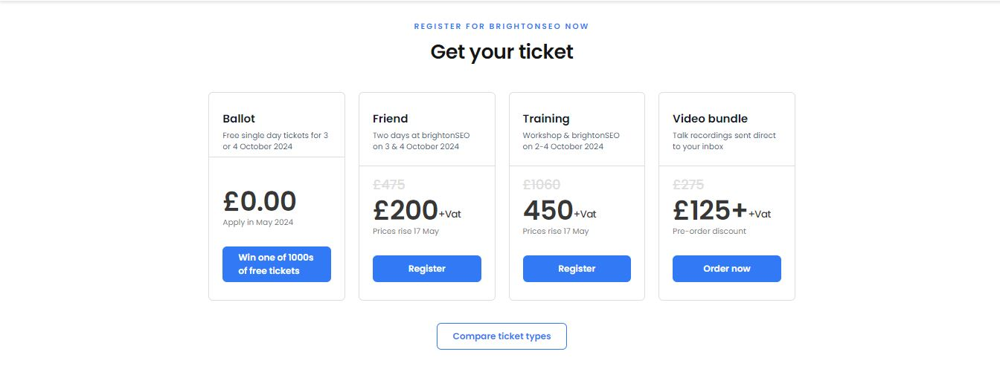
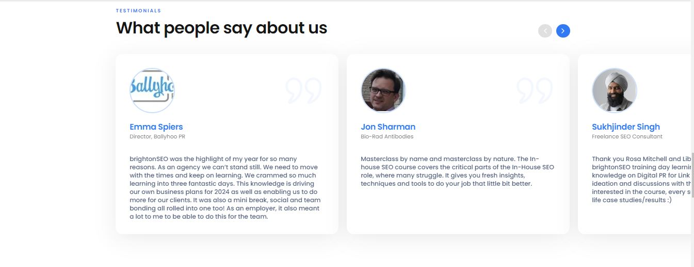
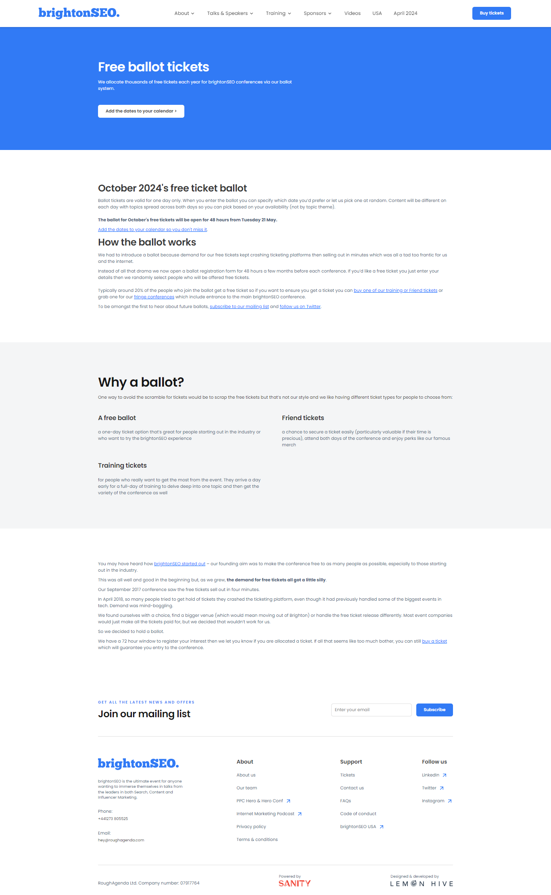
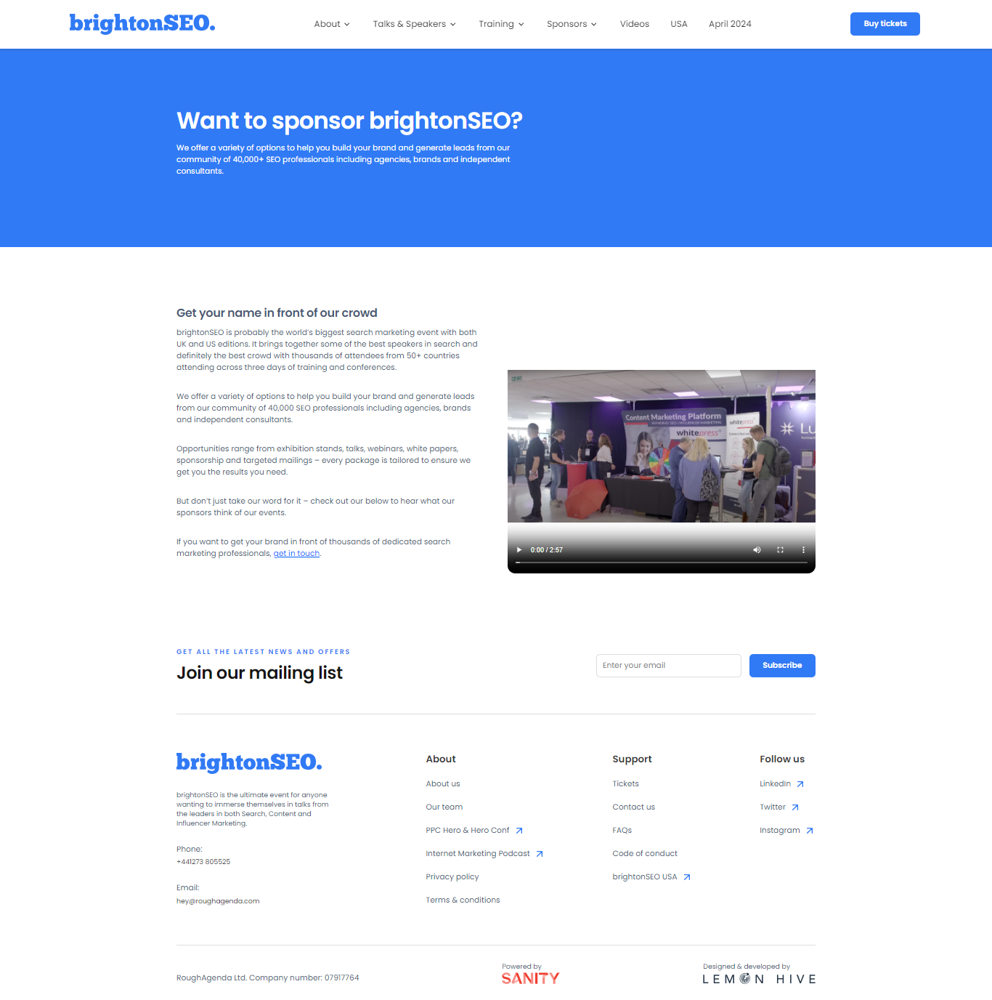
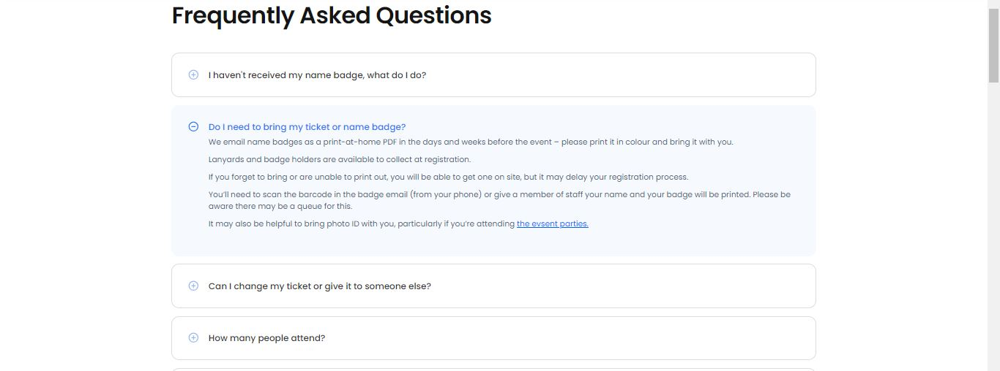

This is a [Next.js](https://nextjs.org/) project bootstrapped with [`create-next-app`](https://github.com/vercel/next.js/tree/canary/packages/create-next-app).

## Content

- [Project Dependencies](/README.md#project-dependecies)
- [Getting Started](/README.md#getting-started)
- [Custom Path Shortcuts](/README.md#custom-path-shortcuts)
- [Apollo Graphql](/README.md#apollo-graphql)

## This project template uses:

- Storybook
- Apollo Graphql
- Tailwind css
- Typescript

## Getting Started

First, run the development server:

```bash
npm run dev
# or
yarn dev
```

Open [http://localhost:3000](http://localhost:3000) with your browser to see the result.

## Custom Path Shortcuts

- **@src/\*** : ./src folder
- **@pages/\***: ./pages folder
- **@styles/\*** : ./styles folder
- **@root/\*** : root directory

## Apollo Graphql

There are different ways to configure apollo client for different
next.js render methods (i.e static page generation, server side rendering)

We need to configure our implementation as needed.

[Getting Started Apollo](https://www.apollographql.com/blog/apollo-client/next-js/next-js-getting-started/)

## My Some Contribution

- **Hero Sections**
  
  [Show Live](https://brightonseo.com/)

- **Card** [Show Live](https://brightonseo.com/)
  

- **Testimonial Cards** [Show Live](https://brightonseo.com/)
  

- **Full Section** [Show Live](https://brightonseo.com/courses)
  

- **About Us Section** [Show Live](https://brightonseo.com/about)
  

- **Handle Rich text** [Show Live Demo One](https://brightonseo.com/ballot) [Show Live Demo Two](https://brightonseo.com/sponsor-brightonseo)
  

  

- **FAQ Handler** [Show Live](https://brightonseo.com/faq)
  
